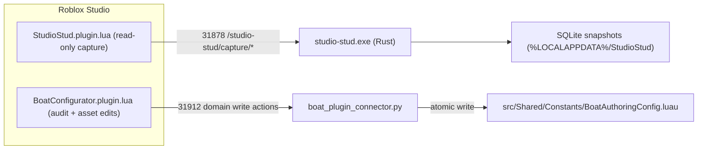
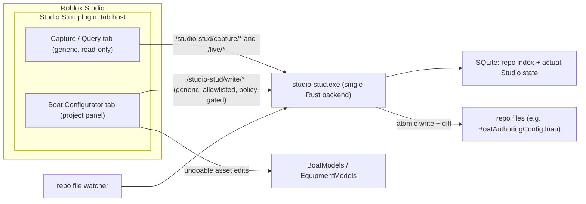
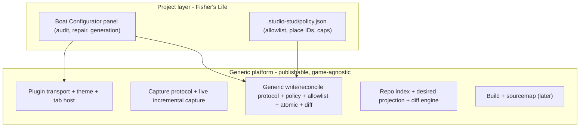
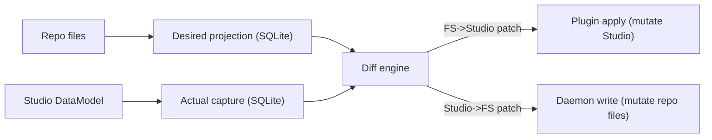
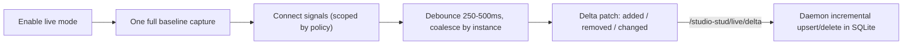
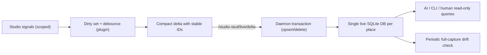

# Studio Stud Platform Design — Core Rojo-Class Sync Platform (Boat Configurator as the final panel)

Status: DESIGN (pre-development). This is the canonical design we line up against before
breaking work into development blocks.

Build order (important): the CORE Studio Stud platform is built and proven FIRST — live capture,
the single live database, the diff engine, FS->Studio live sync, and multi-developer concurrency.
The Boat Configurator is rebuilt LAST, entirely on top of that proven core. The boat work must add
nothing new to the core; it only consumes it.

It supersedes ad-hoc handoff notes and complements the two roadmaps it unifies (both were
FishersLife-internal planning notes that were not migrated into this standalone repo; the staged
delivery plan in Section 11 is the canonical roadmap here):

- Studio Stud "Better Rojo" roadmap (historical, not migrated)
- Boat Configurator plugin plan (historical, not migrated)

This document does NOT replace those plans; it sets the shared architecture both must obey
and weaves the Boat Configurator into the Studio Stud platform as the first project panel.

---

## 1. Purpose and One-Sentence Goal

Evolve Studio Stud from a read-only Studio inspector into one fast, deterministic, local
development platform that (a) keeps a continuously live picture of Studio state, (b) syncs the repo
to and from Studio as fast as Rojo while doing far more — including multiple developers live-syncing the same place at
once, which Rojo cannot do, and (c) hosts portable, toggleable project panels (the Boat Configurator
being the final one), all on a single Rust backend and a single Studio plugin.

This tool must be very fast AND highly trustworthy. It runs against live Studio places; an incorrect
or partial write is unacceptable. Trust (accuracy, no data loss, never clobbering another developer's
work, fully undoable) is a first-class requirement, equal to speed, throughout this document.

---

## 2. Vision and Goals

1. One backend, one front end, one update target. Retire the separate Python connector
   (`tools/boat_plugin_connector.py`, port 31912) and the separate boat plugin entirely. Everything
   runs through the Rust daemon (`src/main.rs`, port 31878) and ONE Studio plugin
   with a tab host. There is only ever one plugin to update. Project tabs (e.g., Boat Configurator)
   are toggleable in settings so the same plugin is portable to any place.
2. Generic core, project panels on top. The Rust daemon and the plugin shell stay game-agnostic
   and publishable. Boat domain logic lives in a clearly separated project panel/module, never in
   the daemon core. "Same front and backend" is achieved through shared infrastructure, not by
   dissolving boat logic into the platform.
3. Diff-driven, bidirectional sync. The platform's heart is a diff engine over a desired state
   (repo projection) and an actual state (captured Studio). Both FS->Studio sync and Studio->FS
   reconcile are patch operations over that diff.
4. Zero-token, zero-interaction runtime. Routine capture, sync, build, and policy-gated writes are
   deterministic local code paths that never require an AI agent. AI/CLI/human surfaces are
   read-only reporting layers over deterministic state.
5. Always-fresh state. Move from request-based full captures toward an event-driven, incremental
   "live" capture so the database continuously reflects Studio without a manual capture request.
   One live SQLite DB per place; live data stays AI-first and token-neutral (see 5.6 and 5.7).
6. Best-practice engineering. Modular Rust, fixtures, benchmarks, deterministic output, atomic
   writes, undoable Studio edits, policy gating, and tests at every stage.
7. Multi-developer live sync (hard requirement). More than one developer must be able to live-sync
   the same place at the same time (same GitHub repo, same Team Create place), at Rojo's single-client speed and without clobbering each other. Rojo cannot do this; we
   must. See Section 6.2.
8. Trust bar. No data loss, no partial writes, no silent clobbering, everything undoable, every
   apply hash-guarded. We must KNOW it works before we trust it with a live place.
9. Core first, boat last. Build and prove the generic platform before rebuilding the boat panel on
   top of it.

### Non-Goals / Guardrails (do not violate)

- No boat/game logic in `main.rs`. The daemon's write/reconcile layer is generic and allowlisted.
- No client-authoritative game logic. (This is a dev tool; it never ships in the game runtime.)
- Capture/query stays stable and visually/technically separate from sync/write until sync is proven.
- No data loss. Live capture mirrors the full DataModel; nothing the user cares about is dropped
  (Section 6, Decision D4).
- No silent clobbering. Concurrent/stale writes are detected by hash guard and reported as conflicts,
  never blindly overwritten (Section 6.2).
- No full-snapshot-per-change. Live updates apply only deltas to the single live DB; full snapshots
  happen on connect and as a periodic drift backstop, not on every edit (Section 6).
- Two distinct write surfaces stay separate:
  - Repo file writes (generated config, scripts) -> daemon's generic write/reconcile protocol.
  - Studio asset edits (attachments, CFrames, rope anchors) -> stay in the panel, undoable via
    `ChangeHistoryService`. The daemon never authors boat geometry.
- Build order is a guardrail: do not start the boat panel until the core platform stages pass.

### Repository / publish boundary

This repo is the DEVELOPMENT space. The full apparatus — Rust daemon source, fixtures, benchmarks,
internal docs, `.cursor/` rules and plans, and this design doc — is dev-only and largely gitignored.
What is pushed/published is the CONSUMER-FACING plugin only. Two consequences: (1) verification is
local-first and zero-token — the test, golden, parse, and benchmark gates run on the developer's
machine, not as published-crate CI; and (2) the "publishable, game-agnostic" goal refers to the
plugin (and, if/when distributed, the daemon binary), NOT to publishing the dev tree as a crate.
Wherever this doc says "CI," read it as local, deterministic, zero-token gating appropriate to a
dev-space repo — not crate-registry hygiene.

### Distribution and lifecycle (installer platform)

Distribution is **GitHub-only** (no Creator Store). A separate `studio-stud-setup` binary provides
GUI install/uninstall and CLI `health` / `repair` / `update` / `repo-health` / `repo-repair`.

- **Centralized install** — daemon + bundled addon payloads live under one user `installRoot`; the
  core plugin is installed once into the Roblox Plugins folder; each registered repo only receives
  `.studio-stud/` managed files (policy, markers, per-repo addon config).
- **Active repo** — the long-running daemon resolves `PlaceId -> registered repo` per HTTP request
  (not `cwd` at `serve` startup). Capture/live/write semantics are unchanged once `repo_root` is
  resolved. Unmapped places return `unbound` until bound via installer or `POST /studio-stud/context/bind`.
- **Addons** — separate Studio folder plugins (not core tabs); bundled hidden under `installRoot/addons/`;
  enabled from the core plugin settings UI via daemon file ops (write-token gated).
- **Channels** — `release` / `beta` / `development` on one Pages site (`/`, `/beta`, `/dev`); beta/dev
  artifacts encrypted locally; passwords only in gitignored `secrets/` on the maintainer machine.

This does not change Stage 4–7 diff/sync goals; it replaces per-repo `.studio-stud-tool/` bundles and
manual plugin file loading.

---

## 3. Current State (verified)



Verified facts:

- Daemon: Rust, `tiny_http` + `rusqlite` (bundled) + `serde` + `sha2` + `flate2`. CLI subcommands:
  `status`, `doctor`, `ingest`, `analyze`, `query`, `capture`, `serve` (+ hidden `daemon`).
  Routes are all read-only capture: `/studio-stud/ping`, `/manifest`,
  `/capture/request|start|body|chunk|complete|status`. `DaemonState` holds `pending_requests`,
  `uploads`, `completions`. Protocol version 1; `MIN_PLUGIN_PROTOCOL_VERSION` gate exists.
  Per-place storage today keeps `syncs.db` (SQLite) PLUS `latest.json` / `previous.json` pointers
  feeding a snapshot-vs-snapshot `Comparison` report (`previous_capture_for_place`, `comparison_json`)
  — the backup-and-compare model retired in 5.6.
- Capture plugin: read-only. Polls `/capture/request` every 2s; on request builds a full snapshot
  (`collectBaseInstances` walks ordered root services, reads a curated `CLASS_PROPERTIES` set with
  pcalls, serializes typed values) and uploads via body or chunked transfer. Single dock widget
  with a home panel + settings panel; `THEME`/font constants; `requestJson`/`requestBody` transport.
- Boat connector: Python, port 31912. Domain actions `health`, `readAuthoringState`,
  `previewBoatAuthoringDiff`, `applyBoatAuthoringConfig`, `validateGeneratedConfig`. Token auth,
  protocol/schema versioning, allowlisted to write ONLY `BoatAuthoringConfig.luau`, deterministic
  Luau generation + shape validation, atomic temp-file + `os.replace`, unified diff response.
- Boat plugin: separate `plugin:CreateToolbar("Fisher's Life")` + dock widget. Audit + Fix dashboard
  with undoable repairs (`setBestPrimaryPart`, `ensureSlotPointsFolder`, `repairSideNameplates`,
  `repairSnapPoints`, rope anchors), and connector calls for repo writes. Token stored in plugin
  settings; `DEFAULT_URL = http://127.0.0.1:31912`.

Problems with the current shape: two daemons, two ports, two tokens, two plugins/toolbars, two
protocols. Connector and plugin sprawl. The boat write path is a tiny bespoke clone of exactly the
deterministic, policy-gated, allowlisted, atomic write service the Rojo plan needs generically.

---

## 4. Target Architecture



### 4.1 Layering



The dividing line is strict: anything that knows the word "boat" lives in the project layer.

---

## 5. Core Concepts

### 5.1 Desired vs Actual, and the Diff Engine

- Actual state: what is in Studio right now, captured into SQLite (today: on request; target: live).
- Desired state: the repo projected into Studio instances via the Rojo project parser
  (`default.project.json` is one projection from the full repo, not the whole definition).
- Diff engine: compares desired and actual; classifies changes by semantic risk (safe script
  update, structural create, delete, ownership conflict, unsupported feature).
- Patches: a diff turned into ordered operations. Direction decides who applies the patch:
  - FS -> Studio: plugin applies instance mutations (Rojo parity / live sync).
  - Studio -> FS: daemon writes files (reconcile). The boat config write is a constrained case.



Projection fidelity (load-bearing): the desired projection must reproduce Rojo v7's projection
semantics faithfully — `$path` / `$className` / `$properties` / `$ignoreUnknownInstances` / `$id`,
`init.luau` / `init.server.luau` / `init.client.luau` collapsing a directory into a script,
`.meta.json` sidecar merging, nested project files, and deterministic ordering. Getting this subtly
wrong silently corrupts the desired side of every downstream diff, so the projection parser is
treated as its own hardened sub-component with its own fixture corpus — borrow and adapt Rojo's own
projection test fixtures for parity. Build on the `rbx-dom` crate family that Rojo itself uses —
`rbx_dom_weak` (DOM), `rbx_reflection` / `rbx_reflection_database` (class/property reflection), and
`rbx_xml` / `rbx_binary` (`.rbxmx` / `.rbxm` (de)serialization) — rather than hand-rolling reflection
and model serialization; this cuts work and inherits Roblox's reflection metadata.

### 5.1.1 What the FS->Studio sync watches (file scope)

Answering "should we only watch Luau?": for Fisher's Life, the synced source is almost entirely Luau
scripts + folder structure, because Workspace, Lighting, SoundService, and ServerStorage are
`$ignoreUnknownInstances` (Studio-managed) in `default.project.json`. So the live-sync MVP watches:
`*.luau` (and `*.server.luau` / `*.client.luau` / `init*.luau`) plus folders. That is the 95% case
and exactly what actually transfers into the game.

Rojo also supports other file types, and for full parity we eventually can too, but we do NOT need
them for the MVP and several may never matter for us:

- `.meta.json` (className/properties), `.model.json` (hand-authored instance trees)
- `.json` / `.toml` modules -> ModuleScript source
- `.txt` -> StringValue, `.csv` -> LocalizationTable
- `.rbxmx` / `.rbxm` models, attributes, tags, property serialization

Decision: Luau + folders first (Stages 4-5). Broaden to other file types only as a later parity slice
(Stage 7) when a real repo file actually needs it. Studio-owned content stays Studio-owned.

### 5.2 Generic Write / Reconcile Protocol (new, beside capture)

New namespace `/studio-stud/write/*`, deliberately separate from `/capture/*`:

- `POST /studio-stud/write/validate` — validate a proposed write (path allowlisted, size under cap,
  required header marker present, valid UTF-8, optional Luau-parse check). No write.
- `POST /studio-stud/write/preview` — return a compact unified diff + `changed` flag. No write.
- `POST /studio-stud/write/apply` — atomic temp-file + replace; return diff + byte count + outcome.

Contract:
- Token required (writes are higher-risk than read-only capture).
- Path must match the policy allowlist; arbitrary paths are rejected.
- Content is provided by the client as finished text (see Decision D1 / Option A).
- Deterministic: same input -> byte-identical file; newline-normalized; atomic replace.
- Compact JSON responses with stable fields; never echo full file bodies unless requested.

### 5.3 Policy File: `.studio-stud/policy.json`

Per-project trust policy that makes unattended operation safe and deterministic. Initial fields:

- `allowedWritePaths`: glob allowlist (e.g., `src/Shared/Constants/BoatAuthoringConfig.luau`,
  later generated-config and owned-script globs).
- `allowedPlaceIds`: place IDs the plugin may sync/write against.
- `maxPatchBytes`, `maxPatchItems`, `maxDeleteCount`: hard caps; exceeding => deterministic block.
- `requireGeneratedHeader`: paths that must carry an `-- AUTO-GENERATED` marker before write.
- `liveCaptureScope`: roots eligible for live incremental capture (perf control).
- `unsupportedFeatureBehavior`: block / build-only / ignore / studio-owned.

Risky operations are blocked with a nonzero exit code and a structured reason, never an AI prompt.

### 5.4 Plugin Tab Host (panel registry)

`StudioStud.plugin.lua` becomes a shell that provides the toolbar, dock widget, theme, transport,
and a panel registry. Panels register `{ id, title, build(parentFrame, ctx) }`. The generic build
ships the Capture/Query panel. Project panels (e.g., Boat Configurator) register themselves and are
toggled on/off in settings, so the single plugin is portable to any place — enable the Boat tab in
Fisher's Life, leave it off everywhere else (Decision D2: one plugin, one update target).

Everything in the plugin is dynamic: tabs, the boat audit/repair lists, and connection/live status
all render from live data, not hardcoded layouts. The Boat Configurator goal is that a developer can
author EVERYTHING about a boat through this GUI — no hand-writing config or command-bar scripts.

### 5.5 Generation Location (Decision D1 — RESOLVED: Option A)

Your reasoning confirms this: we are building FS->Studio sync to be Luau-centric, and the boat panel
should let you configure everything via GUI rather than writing code. The boat config still has to be
persisted as a repo file (`BoatAuthoringConfig.luau`) so the runtime can consume it and the live-sync
can carry it into Studio like any other Luau. So:

- RESOLVED — Option A: the boat panel renders the finished `BoatAuthoringConfig.luau` text in Luau and
  hands it to the generic write endpoint. The daemon validates generically (path allowlisted, size,
  header marker, UTF-8, optional Luau parse) and writes atomically. The daemon never knows the boat
  schema. This keeps the core generic/publishable and matches "do everything in the plugin."
- Rejected — Option B (daemon-owned generation): would bake a game-specific schema into the shared
  tool. The future Rojo build engine emits generic Luau (folders/scripts/properties), not boat
  schemas, so daemon-owned boat generation is never required for parity anyway.

Determinism is preserved either way (string-building is deterministic). The existing Python rules
(`generate_luau`, `validate_config`) are reimplemented in the Luau panel as the single source of
truth, and kept as a reference oracle for golden parity tests during the boat rebuild (Stage 8).

### 5.6 Single Live Database Per Place (SQLite) — Decision D7

Decision: one live SQLite DB per place (`syncs.db`) that always reflects the current Studio state.
Each place (e.g., Mike's Resort, Kelley's Island) keeps its own single live DB — never a shared one.
Retire the `latest.json` / `previous.json` backup-and-compare model and the snapshot-vs-snapshot
`Comparison` report.

A full capture runs on every new connection (plugin startup / reconnect) to guarantee the DB holds
the latest, complete state with nothing missing — then live deltas keep it current (Section 6). The
"one live DB per place" replaces the old multi-snapshot history; it is the always-current truth, not
an append-only log of full snapshots.

Why: with live incremental capture (Section 6), the DB is the always-current source of truth.
History and change reporting come from the diff engine (desired vs actual) and an optional bounded
delta journal — not from keeping a full previous snapshot to diff a current snapshot against. The
old two-snapshot model exists only because captures were discrete, infrequent events; live capture
removes that premise.

SQLite is the database, and it fits the high-speed goals:

- Single writer (the daemon) means no write contention; enable WAL mode so AI/CLI reads never block
  on an in-flight delta ingest.
- Each delta is applied as one transaction of prepared upsert/delete statements; indexed lookup
  columns (path, class, id) keep `query`/`analyze` bounded and fast.
- Bundled `rusqlite` (no external service, no network DB) means local-file latency — sub-millisecond
  to low-millisecond for our row counts — and zero deploy/runtime dependencies.
- Deterministic, indexed reads keep the AI surfaces token-cheap (Section 5.7).

What changes in code (later stages, not now): `PlaceStorage` drops `latest_path`/`previous_path`;
the `captures` table collapses to a single current/live row per place plus an optional bounded delta
journal; `ReportView::Comparison`, `previous_capture_for_place`, and `comparison_json` are removed or
repurposed toward desired-vs-actual reporting. A single raw snapshot may be retained only for
cold-start/debug; otherwise the live DB is canonical.

### 5.7 AI-First Output Discipline (preserved under live capture)

Studio Stud's only legitimate AI touchpoint is read-only querying of the DB (`analyze`, `query`).
Live capture must not change that or make AI usage less efficient. Rules:

- AI stays a read-only reporting consumer, never in the capture/sync/write control loop. Capturing,
  debouncing, diffing, ingesting deltas, and writing files are deterministic local code — zero tokens.
- Going live changes nothing about token cost: the AI simply queries fresher data for free. It does
  NOT mean continuously streaming state to an agent. There is no automatic AI notification per delta.
- Live deltas and DB reads keep the existing AI-first discipline: bounded result sets
  (`returned`/`total`/`limit`/`truncated`), stable IDs, hashes + byte counts instead of raw bodies,
  compact JSON by default, markdown only on request, and suggested follow-up selectors.
- The DB schema stays query-shaped (indexed, normalized columns) so a single bounded query answers a
  question without the agent reading raw snapshots.
- Guard: do not let "always live" tempt any always-on AI behavior. The tool is silent to AI until an
  agent explicitly runs a read-only query.

---

## 6. Live State Model (continuous capture)

Goal: the database continuously reflects Studio, so a manual capture request becomes optional. Live
capture is a setting, enabled by default, and can be turned off if the user wants request-based
captures only.

Two hard guarantees (Decision D4 + Trust bar):

- No data loss. Live capture mirrors the full DataModel — everything a request-based capture would
  cover. Going live does not narrow what we track; it changes HOW we keep it current (deltas instead
  of repeated full snapshots).
- No full-snapshot-per-change. A full capture runs once on connect (and as a periodic drift
  backstop). After that, ONLY the things that changed are sent and merged into the live DB. We never
  rebuild the whole DB on each Studio edit.

Current cost model (request-based full capture): roughly linear in instance count — full DataModel
walk + per-property pcalls + JSON encode + chunked HTTP + Rust parse + SQLite insert. Exact latency
is unmeasured today; Stage 0 adds timing instrumentation and a benchmark fixture before we optimize.

Target: event-driven incremental capture (full coverage, delta transport).



Design points:
- Baseline + deltas. Full capture on every connect; then only send what changed.
- Full coverage (D4). We watch all captured roots, not a narrowed subset. Structural changes
  (`DescendantAdded` / `DescendantRemoving`) are cheap and global. Property changes are the hard part
  because Roblox has no global "any property changed" signal (see the property-coverage note below).
- Signals: `DescendantAdded` / `DescendantRemoving` globally on captured roots,
  `GetPropertyChangedSignal` for the curated `CLASS_PROPERTIES` set (connected/disconnected
  dynamically as instances are added/removed), `Selection.SelectionChanged`, and
  `ChangeHistoryService` waypoints.
- Debounce so save/edit storms become one delta.
- Deterministic reconciliation: deltas carry stable instance IDs; the daemon upserts/deletes rows so
  a fresh full capture and the delta stream converge to byte-identical state.
- Drift backstop (guarantees no data loss): a periodic (and on-demand) full capture is compared to
  the delta-built state; any divergence is corrected and reported, never silently tolerated.

Events we watch, how, and what we might miss (Decision D4 detail):

| Change in Studio | Event we connect | How | Coverage |
| --- | --- | --- | --- |
| Add instance | `<root>.DescendantAdded` | One connection per captured root; fires for any new descendant | Complete |
| Remove instance | `<root>.DescendantRemoving` | One connection per captured root | Complete |
| Reparent / move | shows as Removing + Added | Same as above; path recomputed | Complete |
| Property change (tracked) | `inst:GetPropertyChangedSignal(prop)` | Connected per instance for the curated `CLASS_PROPERTIES` set as instances are discovered; disconnected on removal | Complete for the tracked set |
| Attribute change | `inst.AttributeChanged` | Per instance | Complete |
| Tag add/remove | `CollectionService` tag signals | Per tag | Complete |
| Selection-driven edits | `Selection.SelectionChanged` | Re-read full props of selected instances on demand | Targeted |
| Undo / redo / bulk paste | `ChangeHistoryService` waypoint signals | Trigger a targeted rescan of affected/dirty instances | Backstop for bulk ops |

How it runs: on baseline we register the curated property-changed connections per instance; on
`DescendantAdded` we register them for the new instance; on `DescendantRemoving` we disconnect and emit
a removal. A dirty set accumulates touched instance IDs, debounced ~250-500ms, then flushed as one
delta.

What we might miss (and why it is safe): the only gap is a property OUTSIDE the curated
`CLASS_PROPERTIES` set — but those are not captured by request-based capture either, so live mode is
no worse than today (no regression). Bulk operations (undo/redo, large paste) can fire many or
coalesced signals; the `ChangeHistory`-waypoint rescan covers those. A brief disconnect is covered by
the full re-baseline on reconnect. And the periodic full-capture drift backstop is the catch-all: it
diffs the delta-built DB against a fresh full capture and corrects + reports any divergence, so the
no-data-loss guarantee never depends on perfect signal coverage.

Open engineering choice (benchmarked in Stage 2): whether to cover the tracked property set via
dynamic per-instance listeners (immediate, more connections) or via waypoint-triggered targeted
rescans (fewer connections, slightly less immediate). Correctness is identical because of the drift
backstop; this is purely a performance tuning decision. `liveCaptureScope` survives only as an
optional perf escape hatch for pathologically large places — the default is full coverage.

Why this matters for Rojo replacement: a continuously fresh actual state makes FS->Studio diffs
instant and makes Studio->FS reconcile trustworthy.

### 6.1 Live Data — Both Ends Summary

Plugin end (producer, in Studio / Luau):

1. On live enable, run one full baseline capture (the existing capture path) and ingest it.
2. Connect scoped signals: `DescendantAdded` / `DescendantRemoving` on policy-scoped roots,
   `GetPropertyChangedSignal` on scoped/selected instances, `Selection.SelectionChanged`, and
   `ChangeHistoryService` waypoints. No blanket per-instance property listeners.
3. Maintain a dirty set; debounce ~250-500ms; coalesce repeated edits to the same instance.
4. Emit a compact delta `{ added: [entries], removed: [ids], changed: [{ id, props }] }` with stable
   IDs; reuse the chunked transport if a delta is large. Send to `/studio-stud/live/delta`.

Daemon end (consumer, in Rust):

1. Receive deltas on the capture trust model (localhost, no write token — deltas touch only the local
   DB, never the repo, so they are not gated like `/write/*`).
2. Apply each delta as one SQLite transaction: upsert added/changed rows, delete removed rows, and
   incrementally update (or mark dirty for recompute) `class_counts` / `keyword_hits` /
   `critical_presence`.
3. Bump a live revision + `updatedAt`; the single live DB per place (Section 5.6) stays queryable at
   all times.
4. Drift guard: on a timer or on demand, run a full capture and compare it to the delta-built state;
   report drift rather than silently diverging. Strengthened and layered for live multi-developer +
   AI in Section 6.3 (covers replicated teammate edits; cheap frequent checks via a state fingerprint).

Query end (AI / CLI / human): unchanged `analyze` / `query` commands read the always-current live DB.
No capture request is needed, and no extra tokens are spent (Section 5.7).



### 6.2 Multi-Client / Team Create Concurrency (HARD REQUIREMENT)

More than one developer must be able to do live work in the same place at the same time -- often, and
both driving AI -- fast, without clobbering, and WITHOUT any manual ownership map to maintain.
`rojo serve` serves a single connected client; we support several at the same speed Rojo gives that one
client, on one shared place. First-class requirement. Concrete target: two developers on the SAME GitHub
repo, both in the SAME Team Create place, editing simultaneously with AI.

#### Two shared surfaces, and where the tool sits

- The git remote -- the durable shared truth for source. You push/pull here, and source merging happens
  here. The tool is NOT a git client: it never pulls, commits, pushes, or merges -- you run git yourself.
- The Team Create DataModel -- the live shared runtime, replicated between both Studios by Roblox.
- Each developer has their OWN repo clone, daemon, and plugin; there is no shared sync server.

The complexity of this whole section exists ONLY because you share one Team Create place. If you each
worked in your own Studio and shared via git, none of it would apply.

#### Core idea: the live place is the sync bus

Team Create already replicates the live DataModel between your Studios in real time -- so use that as the
sync bus for your files too. Each machine runs a continuous BIDIRECTIONAL mirror: file->live (your AI
edits the file; the tool pushes the source into your Studio's live script) and live->file (the live
script changes -- including teammate edits arriving via Team Create -- and the tool writes that source
down into your file). The path of one edit is: your file -> your live script -> (Team Create) -> his live
script -> his file, ~1-2s end to end.

Consequence: DURING a co-present session, files stay in lockstep through the shared place; git drops back
to durable history + how you sync when you are NOT co-present. This is why "my AI edits X, 15s later his
AI edits X" just works -- your change is in his FILE ~2s later, so his AI builds on top of it.

#### Safety: content compare-and-swap, in the plugin, at apply time

Every write checks, in the plugin against the live DataModel: does the live script still hash to the base
this edit was made from? Match -> write (new `rev`, `writer = me`). Mismatch -> conflict, never clobber.
In-plugin makes it staleness-proof (the plugin is in-process with the replicated DataModel). The content
hash is computed from the ACTUAL live source (truth), not a cached attribute, so it is robust to
attribute-replication ordering. This is the non-bypassable correctness guarantee.

#### Per-file base tracking (load-bearing)

The "base" is the common ancestor: the hash a file had the last instant it matched live. The tool records
it on every clean sync. Both the CAS and the 3-way merge depend on it; lose it and you degrade to a 2-way
(everything looks conflicting). It has to be bulletproof -- everything good flows from it (Appendix F/G).

#### Dynamic ownership replaces a static map

No manual `ownedPaths` to maintain. Instead, a transient per-script claim: when a developer's edit starts
applying, the tool sets a short, self-expiring `editing` marker on that script (replicated via Team
Create) that auto-releases on commit/idle/timeout. A foreign active claim makes the other side HOLD +
warn (below). Static `ownedPaths` / `ownedServices` are demoted to an OPTIONAL coarse override for teams
that want hard lanes -- off by default. Provenance rides on two replicated attributes, `lastWriter` and
`rev`. Split: the content hash is the SAFETY guarantee; `lastWriter`/`rev` are provenance/UX only -- if
they lag a beat, worst case is a vaguer message, never a wrong safety call.

#### Editing is never blocked -- only propagation of a stale edit is gated

The tool is downstream of the file write; it cannot and will not stop your AI from editing. The only
chokepoint is the file<->live boundary. A "blocked"/quarantined script is one whose local edit cannot
cleanly apply to the current live version: the tool holds it back instead of clobbering and surfaces it;
your local edit is preserved (stashed). Reconcile is manual / AI-assisted (Section 6.4).

#### How overlap is handled, in order

1. Active claim -> hold + warn (pre-emptive). Start editing X while the other developer's claim is live
   and the plugin warns the moment your file diverges and HOLDS your push rather than racing it in -- you
   can wait for him to finish and avoid the conflict entirely. Self-healing: if his claim expires without
   a commit, your held edit re-checks against the unchanged live and pushes clean.
2. Stale base -> deterministic 3-way merge (the "mini-rebase"). If you proceed, or the claim did not
   arrive in time, the CAS catches it and the engine runs a 3-way merge of base / mine / theirs:
   - Non-overlapping hunks (you and he touched different parts) combine automatically -- exactly what git
     does on rebase -- applied as a fast-forward on top of his version and mirrored back to your file. No
     AI, no notification.
   - Overlapping hunks (you both changed the same region) -> quarantine + notify + diff; only those hunks
     go to the AI via `flctl sync explain` (Section 6.4).
3. Reconcile -> manual / AI-assisted, engine-gated. The AI resolves only the conflicting hunks, writes
   the file, and the engine re-validates (parse + CAS vs the CURRENT live + post-write convergence) before
   it goes live. The decision is yours; detection, the merge, quarantine, and safe re-apply are the tool's.

Refinement of the earlier "no merge" line: the tool never silently merges CONFLICTING code, but it DOES
combine NON-conflicting changes deterministically -- that distinction is what makes constant AI-driven
multi-developer work livable instead of a reconcile every few minutes. The durable layer is still git.
Conflicts are scoped to the diverging developer: the person whose version is already live keeps working
uninterrupted; only the one who diverged sees a reconcile prompt. Interruptions scale with ACTUAL OVERLAP,
not activity.

#### The residual hard edge, and the net that makes it safe anyway

One case cannot be PREVENTED without a single serialization authority (a server, or routing every live
edit through git's push-CAS -- neither of which we want): if you and he commit to the same script WITHIN
Team Create's replication latency, both CAS checks pass locally and Team Create resolves the two writes
last-write-wins -- one loses. The window is sub-second to a couple seconds; AI edits take several seconds
to generate, so it is rare. We make the loss impossible to be SILENT: (1) the transient claim shrinks the
window; (2) a post-write convergence check re-reads the settled live value after each write and, if it is
not what you wrote and your write was concurrent, surfaces "your edit to X was superseded by Bob's
concurrent edit -- here is your diff" (stashed), never dropped.

So in plain terms: edits seconds apart just work; overlapping edits 3-way-merge or quarantine; truly
simultaneous edits are rare and never silently lost.

Honesty note: combining Team Create live collaboration with file-based sync is the genuinely hard part --
most Rojo teams avoid Team Create for exactly this reason -- which is why it is the headline "beyond Rojo"
capability and the riskiest stage (Stage 6 + Final Verification). It is tractable because correctness
rests on the in-plugin content CAS + per-file base tracking + post-write convergence, NOT on perfect
replication timing, and because the deterministic 3-way merge keeps true conflicts rare. The AI-callable
reconcile interface that makes conflicts safe to resolve is Section 6.4.

### 6.3 Accuracy and Freshness Guarantees (live multi-developer + AI)

Accuracy and freshness are first-class, equal to speed and safety. Two facts make this non-negotiable
here: (1) the hash guard that prevents clobbering is only as trustworthy as the live state it checks
against, so a stale DB is a SAFETY problem, not just a staleness annoyance; and (2) with two live
developers and AI agents both reading the DB to decide what to edit, an inaccurate or lagging DB directly
causes wrong edits. The live state must be very accurate and constantly up to date.

Replicated changes are first-class capture inputs. In Team Create, a change one developer makes
replicates into the other's DataModel. Live capture treats replicated changes exactly like local ones --
the same `DescendantAdded` / `DescendantRemoving`, property, attribute, and tag signals fire on the
receiving client for replicated edits, and the same dirty-set / debounce / delta path carries them into
the DB. We never DEPEND on every replicated signal firing, though: whether each replicated property
change reliably raises a client-side signal is exactly the kind of assumption the drift backstop exists
to cover.

The drift backstop is layered and load-bearing (strengthened). A single slow timer is not enough for two
live developers. Drift detection runs at three cadences:

- Continuous (primary): the live delta stream keeps the DB current in near real time.
- Targeted / immediate (event-triggered): a full re-read of affected instances fires on the events most
  likely to cause divergence -- reconnect / re-baseline, `ChangeHistoryService` waypoints
  (undo / redo / bulk paste), every lease or hash-guard conflict, and AFTER EVERY FS->Studio apply
  (post-apply verification IS a targeted drift check that confirms the live place converged to what we
  applied).
- Periodic (catch-all): a full-capture comparison on a timer is the guarantee of last resort; any
  divergence is corrected and reported, never silently tolerated.

Cheap to run often via a state fingerprint. So drift checks can run frequently without cost, the daemon
maintains a single content fingerprint of the live DB -- a stable, order-independent hash over all
instance hashes (a sorted / XOR or Merkle-style summary, updated incrementally per delta). A drift check
first compares the plugin's fingerprint of the live DataModel against the daemon's DB fingerprint: equal
-> no drift, O(1), done; different -> fall through to the full row-level diff to locate and correct the
divergence. This makes "constantly verify" affordable -- most checks are a single hash compare, and a
full reconcile happens only when something actually diverged.

Convergence is the contract. The guarantee, tested explicitly (Section 12 no-data-loss + determinism
tests), is that the delta-built DB always converges to a fresh full capture -- byte-identical -- under
the layered backstop, for both locally-made and replicated changes. The DB is never silently wrong; if it
diverges, drift detection finds it, corrects it, and reports it.

### 6.4 Reconcile and the AI-Callable Command Layer (`flctl sync`)

Everything in 6.2 is the plugin + daemon, deterministic, with ZERO AI in the loop -- the AI only edits
files. When a script is quarantined, the AI resolves it through a deterministic command layer (the
`flctl` pattern: the engine does the work, emits LLM-optimized output, the AI consumes it and acts). Three
commands; full schemas in Appendix I.

`flctl sync explain <path> --format ai` -- the mini-rebase input. The engine has already run the 3-way
merge, so this returns base / mine / theirs, the count of auto-merged hunks, ONLY the conflicting hunks
(each with its own base/mine/theirs), both intent diffs, the recommended action, the exact submit command,
and where the divergent edit was stashed. The AI resolves only `conflict_hunks` -- never loading the whole
file's history. Token-bounded by construction.

`flctl sync status [--format ai]` -- the startup / reconnect check. It compares three trees -- your files,
the live DataModel, and the per-file base ledger -- and returns counts (clean / behind / ahead / diverged)
plus, per path, a status and recommended action, plus an `integrity` block. Run it on EVERY (re)connect,
not just literal startup: Team Create reconnect, daemon restart, laptop wake. The reason: while your Studio
was closed the live place kept moving (your teammate worked), so you come back behind. The check catches
you up -- auto-pull what cleanly mirrors down, flag what now diverges, and tell you to push your local-only
work.

`flctl sync resolve <path>` -- after the AI writes a resolution, the engine re-validates it (`full-moon`
parse + content CAS against the CURRENT live + post-write convergence) and only then pushes. This is why
the AI can SAFELY handle conflicts: the engine is the gate, not the AI's judgment. If the live version
moved again while the AI was thinking, the CAS bounces the resolution and the AI re-runs `explain`. The AI
proposes; the engine validates and applies.

Deletions, type changes, and integrity are the dangerous edges, so they are always surfaced and never
silently propagated. A delete on one side (`deleted_remote` / `deleted_local`) is flagged with who deleted
it and the content preserved for restore -- never auto-applied as a delete to the other side, especially if
that side has local edits. A type change (script->folder) is `type_changed`. The `integrity` block is the
"something about the sync is wrong" detector: it reports daemon<->plugin connectivity and whether the DB
fingerprint matches the live fingerprint (the Section 6.3 drift check); on mismatch it returns
`re_baseline` as the action.

Notification surface: the plugin is the authoritative reconcile UI, but the developer is heads-down in
their editor, not watching Studio -- so the daemon ALSO surfaces conflict/quarantine status on the
file-system side (an `flctl sync status` / tray-style notifier) so a developer in Cursor is never blind to
a flagged file and does not stack edits on an already-quarantined script.

This layer lives in `flctl` with dense `--format ai` output (conflict-surface-only, token-bounded) and
pairs with the scoped Cursor rule: check `status` on session start; on any flagged file run `explain` ->
resolve -> `resolve`; never hand-edit a quarantined script.

---

## 7. How This Serves the Rojo Replacement

This is the core update, so the platform work IS the Rojo replacement. The thesis is parity on
speed, leap on capability: match `rojo serve` for the single-client case and go far beyond it (live
bidirectional state, multiple developers on one place, integrated panels). Mapping to the existing
6-phase roadmap:

- Live capture + single live DB (this doc, Stage 2) upgrades the "actual" side of the diff engine
  that every later phase depends on.
- Generic write/reconcile primitive + policy (this doc, Stage 3) is the file-write half of Phase 6
  reconcile, built generically and proven with a PERMANENT fixture file (no boat). Its validation
  toolkit (Luau parse, unified diff, atomic write, hash compare) is reused from Stage 4 onward even
  though the repo-file apply path's first workflow consumer is Stage 7 reconcile / Stage 8 boat; a
  permanent golden/integration test keeps the early-built endpoint from bit-rotting across that gap.
- Repo index + read-only project diff (Stage 4) = Roadmap Phase 1.
- One-way FS->Studio sync (Stage 5) = Roadmap Phase 2; needs plugin apply endpoints.
- Multi-developer concurrency (Stage 6) goes BEYOND Rojo (Section 6.2).
- Format parity + build/sourcemap + controlled two-way reconcile (Stage 7) = Roadmap Phases 4-6.

The Boat Configurator (Stage 8, LAST) is then just a consumer of finished platform capabilities —
the generic write primitive, policy/allowlist, tab host, live capture, and shared transport. It adds
nothing to the core. Building the core first means the boat panel is thin and low-risk by the time we
get to it.

---

## 8. Boat Configurator as a Project Panel (rebuilt LAST)

The current boat plugin and Python connector are removed up front (Stage 0) because they are not in
use. The Boat Configurator is then rebuilt from scratch in Stage 8 as a toggleable tab on the proven
platform. Goal: author EVERYTHING about a boat through the GUI — no hand-writing config, no
command-bar scripts. The tab is enabled in settings for Fisher's Life and off elsewhere (portable).

Responsibilities that STAY in the boat panel (Luau, project layer):
- Audit dashboard and boat/slot status model (`Configured`, `NeedsSetup`, `CodeOnly`, `StudioOnly`,
  `Deferred`, `NotInThisPlace`; slot severities `RequiredRuntime`, `DefinedNoContentYet`,
  `FutureAuthoring`, `UnknownExtra`).
- Undoable Studio asset edits via `ChangeHistoryService`: `PrimaryPart`, `SlotPoints`, slot folders,
  default/item snap attachments, Port/Starboard nameplate attachments + rope anchors.
- Deterministic generation of `BoatAuthoringConfig.luau` content (Option A) and its merge contract
  with `BoatDatabase.luau` (`AllowedItems` nil vs empty vs generated removal semantics).
- Equipment safety audit, multi-place awareness, source-template-vs-Workspace-copy safety.

Responsibilities that move to the GENERIC daemon/shell:
- Repo file persistence (atomic, allowlisted, policy-gated, diffed) -> `/studio-stud/write/*`.
- Token/transport/theme/tab hosting -> plugin shell.
- Connection status, protocol versioning -> shared.

Retired up front (Stage 0): `tools/boat_plugin_connector.py`, port 31912, the standalone
`tools/plugin/BoatConfigurator.plugin.lua`, the "Fisher's Life" toolbar, and the boat-specific token
file. The generated `BoatAuthoringConfig.luau` + `BoatDatabase.luau` merge layer is kept as static
data for the eventual rebuild.

---

## 9. Security and Safety Model

- Localhost only (`127.0.0.1`), as today.
- Read-only capture/live deltas stay unauthenticated (low risk; touch only the local DB).
- Writes require a dedicated token (Decision D3). To keep zero friction, the daemon auto-issues the
  token and the plugin auto-loads it via a one-time localhost handshake on connect — no manual paste.
  (Fallback: manual paste, like the old connector, if the handshake is ever undesirable.)
- Allowlist + policy gate every write; arbitrary path or oversized patch is a hard, structured block.
- Atomic writes: render in memory -> validate -> temp file -> `replace`. Never partial files.
- Hash-guarded applies (Section 6.2): a Studio mutation applies only if the live target still matches
  the expected hash; otherwise it is a reported conflict, never a clobber.
- The anti-clobber check is authoritative IN THE PLUGIN against the live DataModel at apply time
  (staleness-proof, because the plugin is in-process with the replicated DataModel), not against a
  possibly-stale DB hash — the DB hash is only an early-warning optimization (Section 6.2).
- Accuracy/freshness is itself a safety property: the hash guard is only as trustworthy as the live
  state it checks, so the live DB is kept continuously accurate and convergent via a layered,
  fingerprinted drift backstop (Section 6.3). With two live developers and AI agents reading the DB, a
  stale or wrong DB causes wrong edits, so accuracy is treated as first-class, equal to speed.
- Studio edits are always wrapped in `ChangeHistoryService` recordings and must close/cancel on
  error to avoid dangling recordings across reloads.
- Place safety: writes/sync honor `allowedPlaceIds` vs the plugin-reported live place.
- Determinism + git as the safety net: generated files are reproducible and reviewable in diffs.
- Trust bar: every mutating path is undoable, idempotent, and verified by a follow-up capture. We do
  not ship a stage until it is proven not to lose data or break the place.

---

## 10. Performance and Determinism Budget

- Cache parsed project trees and file hashes; skip no-op writes (content hash compare).
- Debounce + coalesce file-watch and live-capture events.
- Chunked transport for large payloads (exists); prefer small incremental patches over full snapshots.
- Track timings for: capture walk, JSON encode, transfer, ingest, diff, write. Expose via a
  `--profile`/timing surface.
- Deterministic ordering everywhere (sorted keys, stable IDs) so diffs and cache keys are stable.
- Benchmark fixtures land in Stage 0 and gate later optimization claims.

---

## 11. Staged Delivery Plan

Each stage is independently shippable, has explicit testing, and an exit gate. Development blocks
will be cut from these stages later; do not start a stage before the prior stage's exit gate passes.
Order is core-first, boat-last (Goal 9).

### Stage 0 — Foundations, cleanup, benchmarks
- Goal: ready the codebase to grow, and clear out the unused boat tooling.
- Deliverables: split `main.rs` into modules (cli, storage, capture, live, write, project, diff,
  output); add a timing/benchmark harness + a baseline-capture latency benchmark; document current
  capture cost. Remove the currently-unused boat tooling now: `tools/plugin/BoatConfigurator.plugin.lua`,
  `tools/boat_plugin_connector.py`, the boat token file, and the 31912 port. Keep
  `src/Shared/Constants/BoatAuthoringConfig.luau` + the `BoatDatabase.luau` merge layer as static
  data for the Stage 8 rebuild.
- Testing: `cargo test` unit coverage for extracted modules; capture/query output byte-identical to
  pre-split (golden tests); benchmark produces stable numbers; game still loads with the boat tooling
  removed (no runtime dependency on the deleted plugin/connector).
- Exit gate: no behavior change to capture/query; boat tooling removed cleanly; benchmarks recorded.

### Stage 1 — Plugin shell + tab host + settings (one plugin)
- Goal: refactor into one plugin shell with a tab registry and a settings surface; the single update
  target for everything after.
- Deliverables: tab/panel registry; settings surface (live-capture toggle default-on, per-tab
  enable/disable, daemon endpoint, debounce); Capture/Query becomes the first registered tab; shared
  theme/transport; portability (no project-specific code in the shell).
- Testing: registry register/select/teardown checks; settings persist across reloads; capture/query
  tab behavior unchanged; manual Studio verification.
- Exit gate: one plugin hosts the Capture/Query tab via the registry; capture path regression-free.

### Stage 2 — Live incremental capture + single live DB per place
- Goal: continuously fresh, full-coverage actual state; one live DB per place.
- Deliverables: baseline-on-connect full capture; delta protocol (`/studio-stud/live/*`); signal
  listeners + debounce in the plugin; daemon incremental upsert/delete in transactions; drift
  backstop; migrate storage to one live DB per place (5.6) — drop `latest_path`/`previous_path`,
  remove the `Comparison` report; enable WAL mode; preserve AI-first bounded output (5.7).
- Testing: delta-built state vs full-capture state byte-equality (golden); NO-DATA-LOSS tests
  (drift backstop recovers any missed change); storm/debounce correctness; latency benchmark deltas
  vs full; reconnect re-baselines correctly.
- Exit gate: live mode stays byte-identical to a fresh full capture under the drift backstop; deltas
  measurably cheaper than full captures; perf acceptable on a large fixture place; no data loss.

### Stage 3 — Generic write/reconcile primitive + policy + token
- Goal: deterministic, policy-gated, allowlisted file write in the daemon (no boat consumer yet).
- Deliverables: `/studio-stud/write/{validate,preview,apply}`; `.studio-stud/policy.json` loader +
  `studio-stud policy init|check|explain`; auto-issued write token + handshake (D3); generic
  Luau-parse validation via `full-moon` (D5); unified diff output. Split into a reusable write-safety
  toolkit (parse check, unified-diff generator, atomic temp+replace, hash compare) plus the Studio->FS
  file-write endpoint. Prove the endpoint with a PERMANENT fixture + golden/integration test that runs in
  every later stage so it cannot bit-rot; the toolkit is consumed immediately by Stages 4-5.
- Testing: allowlist enforcement (allowed vs rejected path), size/header caps, atomic write (temp
  cleaned on failure, no partial writes), deterministic byte-identical output, diff correctness,
  Luau-parse rejection of malformed text; policy parse/validation; negative tests => structured
  blocks + exit codes.
- Exit gate: write an allowlisted fixture end-to-end with full validation; reject every out-of-policy
  attempt; no boat code involved.

### Stage 4 — Repo index + read-only project diff (Rojo Phase 1)
- Goal: full repo index + desired projection + read-only diff vs the live DB.
- Deliverables: repo index (path/size/mtime/hash/role), Rojo v7 parsing of `default.project.json`,
  desired projection (Luau + folders focus, 5.1.1) via the hardened projection sub-component on the
  `rbx-dom` crates (5.1), `project diff`, policy readiness report; reuse the Stage 3 parse + diff toolkit.
- Testing: projection parity against adapted Rojo fixtures; project-parser fixtures; diff fixtures with
  hundreds of differing scripts stay bounded;
  ownership-boundary correctness under `$ignoreUnknownInstances`; no Studio mutation possible.
- Exit gate: bounded diff JSON against Fisher's Life; correct repo-owned vs Studio-owned reporting.

### Stage 5 — One-way FS->Studio live sync (Rojo Phase 2)
- Goal: replace `rojo serve` for Luau scripts + folders during a trusted session.
- Deliverables: file watcher -> patch set; plugin apply endpoints (Folder/Script/LocalScript/
  ModuleScript/Source); HASH-GUARDED idempotent applies; place safety; dry-run; post-apply
  verification via live capture (a targeted drift check, 6.3); each apply batch is one undoable
  recording with per-op hash-guard results (6.2); reuse the Stage 3 parse + diff toolkit to validate
  source before it touches the live place. Record, on every clean apply, the hash each file had when
  it last matched live (the per-file base ledger / 3-way common ancestor) that Stage 6's mirror + merge
  depend on (Appendix F/G).
- Testing: create/update/delete/move/rename fixtures; owned-path delete safety; Studio-only content
  untouched; hash-guard blocks a stale overwrite; post-sync capture confirms convergence;
  oversized/place-mismatch patches blocked.
- Exit gate: editing `src/**` updates Studio without Rojo; trusted routine changes apply silently;
  every apply is undoable and verified.

### Stage 6 — Multi-developer / Team Create concurrency (BEYOND Rojo)
- Goal: two or more developers live-edit the same place at once -- fast, non-interrupting, and with NO
  manual ownership map -- via a continuous bidirectional mirror + in-plugin content CAS + deterministic
  3-way merge + an AI-callable reconcile layer (Sections 6.2 and 6.4).
- Deliverables: continuous bidirectional mirror (file<->live both directions; quiescent files silent,
  dirty files flagged) over the Stage 5 per-file base ledger; in-plugin content CAS at apply time;
  `lastWriter` / `rev` provenance attributes; a transient self-expiring per-script claim (foreign claim ->
  hold + warn); deterministic 3-way merge (auto-apply non-overlapping hunks, quarantine overlaps);
  `flctl sync status | explain | resolve --format ai` (Appendix I); reconcile flow (stash the divergent
  edit, surface the diff); deletion / type-change / integrity surfacing; post-write convergence check.
  Static `ownedPaths` / `ownedServices` demoted to an OPTIONAL coarse override (off by default).
- Testing (single-person doable -- required before exit): SIMULATED two-daemon / two-session edits driven
  by one developer; the 3-way merge auto-merges non-overlapping hunks with no prompt and quarantines true
  overlaps; the content CAS blocks a stale apply; the claim holds a foreign edit and expiry frees it;
  `flctl sync status` on (re)connect after a simulated offline gap reports behind/ahead/diverged
  correctly; `explain` output is complete enough to resolve from alone; `resolve` REJECTS a broken or
  stale resolution (the engine is the gate); deletions / type-changes are never auto-propagated; the
  per-file base ledger survives a daemon restart; soak under scripted concurrent edits.
- Deferred to Final Verification (requires real multiple people): true Team Create sessions with 2+ humans
  editing simultaneously; replication-timing under genuine multi-user load.
- Exit gate: simulated concurrent edits -- clean parts auto-merge silently, real overlaps quarantine with
  complete `explain` output, AI-assisted `resolve` pushes only valid + current results, no data loss, perf
  stays interactive. (Real multi-human sign-off happens in Final Verification.)

### Stage 7 — Rojo format parity, build, sourcemap, controlled two-way reconcile
- Goal: enough Rojo v7 parity + offline build/sourcemap + policy-driven Studio->FS reconcile (the LIVE
  bidirectional sync is Stage 6; this is the durable/offline + format-parity layer).
- Deliverables: other file types as needed (5.1.1); `build` + `sourcemap` (headless CI); preview-first
  reconcile with conflict policy.
- Testing/exit gates: per the roadmap acceptance checks in
  `.cursor/plans/studio_stud_rojo_97675197.plan.md` (Phases 4-6); build output opens in Studio;
  sourcemap resolves; CI runs zero-token.

### Stage 8 — Boat Configurator panel (rebuilt LAST, on the proven platform)
- Goal: full boat authoring through a toggleable GUI tab; no hand-writing config or scripts.
- Deliverables: register a toggleable "Boat Configurator" tab; audit + status dashboard fed by the
  live DB; undoable Studio asset edits (PrimaryPart, SlotPoints, slot folders, snap attachments,
  Port/Starboard nameplates + rope anchors); deterministic `BoatAuthoringConfig.luau` generation in
  Luau (Option A) persisted via the Stage 3 write endpoint; equipment safety audit; multi-place
  awareness; source-vs-Workspace-copy safety.
- Testing: generation determinism golden tests (against the retired Python oracle); merge-contract
  tests (`AllowedItems` nil/empty/removal) in `BoatDatabase.luau`; undoable repair tests; end-to-end
  author -> write -> FS->Studio sync -> runtime mount; tab enable/disable + portability;
  `BoatDatabase`/`ModificationDatabase.canEquip`/`BoatSpawnSystem` Luau checks.
- Exit gate: a boat can be fully authored via the GUI on the unified platform; nothing requires
  hand-writing config; the boat tab adds zero new core capability.

### Final Verification — Multi-Person Live Sessions (the very end)

- Goal: collect every test that genuinely requires multiple real people into one final pass, run after
  all single-person stages are complete and green.
- Scope: 2+ humans in a real Team Create place live-syncing simultaneously — distinct paths, then
  overlapping paths; verify leases warn early, hash guards block clobbers, conflicts prompt a rebase,
  replication timing holds, and a soak session stays stable and fast.
- Rationale (your callout): anything one person can verify (including SIMULATED multi-client via two
  local daemons) is done within its stage; anything needing real coordinated people is deferred to
  here so development is never blocked waiting on scheduling.
- Exit gate: multiple developers confirm fast, trustworthy, non-clobbering simultaneous live sync on a
  real shared place.

---

## 12. Testing Strategy (cross-cutting)

Testing philosophy (your callout): every test that a single person can run — including SIMULATED
multi-client tests using two local daemons / two plugin sessions — is required within its own stage.
Any test that genuinely needs multiple real people is deferred to Final Verification at the very end,
so development is never blocked waiting on coordinating people.

- Rust unit tests per module (storage, live, write, policy, diff, project parser).
- Fixture corpora: repo-index fixtures, project-parser fixtures, capture snapshots, generation
  parity matrix, diff fixtures (small and large).
- Golden tests: byte-identical generation; capture/query output stability across refactors;
  delta-built state == full-capture state.
- No-data-loss tests (trust bar): inject changes the live signals could miss; the drift backstop must
  recover them so the live DB always converges to a fresh full capture.
- Concurrency tests (Stage 6): simulated two-daemon / two-session edits; the 3-way merge auto-merges
  non-overlapping hunks (no prompt) and quarantines true overlaps; the content CAS blocks stale applies;
  the transient claim holds a foreign edit and frees on expiry; `flctl sync status` on (re)connect after a
  simulated offline gap reports behind/ahead/diverged; `explain` is complete enough to resolve from alone;
  `resolve` rejects broken/stale resolutions; deletions/type-changes are never auto-propagated; the base
  ledger survives restart; soak under continuous concurrent edits. Real multi-human Team Create timing is
  deferred to Final Verification.
- Safety/trust tests: atomic-write failure leaves no partial file; hash-guard blocks stale
  overwrites; every Studio apply is undoable in one step; place-mismatch and oversized patches block.
- Determinism tests: same input -> identical bytes; sorted ordering; stable IDs.
- Benchmarks: capture-walk, delta, diff, write timings recorded and tracked for regressions.
- Luau-side checks (Stage 8): `BoatDatabase`, `ModificationDatabase.canEquip`, `BoatSpawnSystem`
  mounting; watch the Luau 200-local-register limit on large plugin modules.
- Manual Studio verification per UI stage; use Studio Stud capture/query itself as the post-build
  hierarchy check (dogfooding); `tools/syncback.ps1` only for archive/perf fallback.
- CI (local, dev-space; see Repository / publish boundary): project structure validation and
  build/sourcemap (Stage 7) run headless and zero-token on the developer's machine.

---

## 13. Migration and Rollback

- The boat plugin and Python connector are not in use, so they are removed up front in Stage 0 (no
  parity-bridge needed). They can be restored from git if the eventual rebuild wants them as
  reference. The boat system is rebuilt fresh in Stage 8.
- `BoatAuthoringConfig.luau` + the `BoatDatabase.luau` merge layer stay as static data so the runtime
  is unaffected by removing the tooling; the rebuild reuses the same schema/contract.
- Capture/query remains the stable baseline; live, sync, and write features are additive and behind
  distinct endpoints/namespaces, each separately revertable from git if a stage regresses.
- Rojo removal (from `rokit.toml`, `README.md`, rules/docs) happens only after Stage 5/6 parity is
  proven, with a documented rollback to Rojo.

---

## 14. Open Decisions

- D1 (RESOLVED — Option A, see 5.5): the boat panel renders `BoatAuthoringConfig.luau` text in Luau;
  the daemon writes generically. Aligns with Luau-centric sync and "author everything in the GUI."
- D2 (RESOLVED): one single plugin with a tab host; one update target. Project tabs register and are
  toggleable in settings so the plugin is portable. Packaging sub-question (single composed plugin
  model vs core + sibling module files) is an implementation detail to settle in Stage 1.
- D3 (RESOLVED): dedicated write token, auto-issued by the daemon and auto-loaded by the plugin via a
  one-time localhost handshake so there is no manual paste and no experience hit (fallback: manual
  paste). Capture/live deltas stay unauthenticated.
- D4 (RESOLVED — capture everything, see Section 6): live capture mirrors the FULL DataModel; no data
  loss. Efficiency comes from event-driven deltas + debounce, not from narrowing scope. Open
  engineering sub-question: how to cover EVERY property at scale — dynamic per-instance listeners on
  the curated set vs `ChangeHistory`-waypoint targeted rescans — decided by benchmark in Stage 2.
  Correctness does not depend on the choice because the periodic full-capture drift backstop
  guarantees convergence. `liveCaptureScope` survives only as an optional perf escape hatch.
- D5 (EXPLAINED, adopt in Stage 3): `full-moon` is a Rust Lua/Luau parser (the same parser family
  behind StyLua and selene). We use it so the daemon can verify that generated or synced Luau actually
  PARSES before it writes/applies it — a generic syntax safety net that catches malformed output
  without running it. It is also reusable by the Stage 7 build/sourcemap engine. Recommendation:
  adopt it when the write endpoint lands (Stage 3); it is a cheap, high-value trust win.
- D6 (EXPLAINED, future-only): "Does daemon-owned generation ever return?" Today generation lives in
  the plugin (Option A). If the Stage 7 build engine ever needs the daemon to emit config files
  server-side, we would build a GENERIC data+template mechanism (data in, text out) rather than
  hardcoding any game schema in `main.rs`. Logged so we never accidentally bake boat logic into the
  core later. Not needed for any current stage.
- D7 (RESOLVED, see 5.6): single live SQLite DB per place; full capture on every new connection;
  retire `latest.json`/`previous.json` + the `Comparison` report. Open sub-question: keep a bounded
  delta journal for history, or rely solely on the diff engine for change reporting?
- D8 (RESOLVED, see 6.2/6.4): live multi-developer concurrency = continuous bidirectional mirror through
  the Team-Create-replicated DataModel (the live place is the sync bus) + in-plugin content CAS + a
  deterministic 3-way merge ("mini-rebase") + an AI-callable reconcile layer (`flctl sync explain |
  status | resolve`). A dynamic, self-expiring per-script claim replaces static ownership; `ownedPaths`
  / `ownedServices` survive only as an OPTIONAL coarse override (off by default). No serialization server
  and no routing live edits through git's CAS -- the truly-simultaneous window is accepted, shrunk by the
  claim, and made never-silent by the post-write convergence check. Open sub-questions: exact claim TTL,
  and whether to expose the opt-in coarse `ownedPaths` lanes for teams that want them.

---

## 15. Risks

- Script/source and instance mutation (Stages 5-6) is the highest-risk surface; gate hard behind
  policy + hash guards; everything undoable.
- Multi-developer clobbering / Team Create replication timing (Stage 6) is the hardest correctness risk
  -- mitigated by the in-plugin content CAS at apply (staleness-proof), per-file base tracking, a
  deterministic 3-way merge that auto-resolves non-overlapping edits, a transient self-expiring per-script
  claim (dynamic, no manual map) for early warning, and a post-write convergence check that surfaces any
  superseded edit's diff instead of losing it. No silent clobber, no auto-merge of conflicting code; git
  still owns durable source merges. Proven with simulated multi-client tests per stage and real
  multi-human soak tests in Final Verification.
- Base tracking is itself load-bearing: the 3-way merge depends on the engine always knowing the common
  ancestor (the last hash a file matched live). If it is lost, conflicts degrade to manual 2-way merges,
  so the per-file base ledger must be recorded on every clean sync and survive restarts (Appendix F/G).
- Capture-everything cost: full property coverage via per-instance listeners can be heavy on large
  places — benchmark in Stage 2; fall back to waypoint rescans + drift backstop; never lose data.
- Property-change blind spots: Roblox has no global property-change signal, so the drift backstop is
  load-bearing for the no-data-loss guarantee — so it is layered (continuous deltas + targeted
  post-apply/conflict/waypoint re-reads + periodic full capture) and made cheap to run often via a
  live-state fingerprint (Section 6.3). With two live developers, freshness is also a safety property:
  a stale live state weakens the hash guard, so the backstop must keep the DB continuously convergent.
- Over-building UI before the data model is solid (boat plan's own stated risk) — boat is Stage 8,
  built thin over a proven core.
- Generation parity drift between Luau and the retired Python oracle — lock with golden tests in
  Stage 8.
- Compact output vs human/AI debuggability — every compact command needs an explicit detail path.
- Scope creep toward full Rojo parity before core stages land — resist; ship Stages 0-5 first.

---

## 16. References

- Staged delivery plan: Section 11 of this document (canonical roadmap)
- Dev-history plans (archived): `docs/plans/`
- Daemon: `src/main.rs`, `Cargo.toml`
- Capture plugin: `plugin/StudioStud.plugin.lua`
- Boat connector (remove in Stage 0): `tools/boat_plugin_connector.py`
- Boat plugin (remove in Stage 0, rebuild in Stage 8): `tools/plugin/BoatConfigurator.plugin.lua`
- Generated config + merge: `src/Shared/Constants/BoatAuthoringConfig.luau`,
  `src/Shared/Constants/BoatDatabase.luau`
- Tool docs/rules: `docs/usage.md`, `consumer-template/.cursor/rules/studio-stud.mdc`

---

## 17. Technical Appendix (per-phase core specifics)

This appendix is intentionally concrete so each stage can be planned in its own chat from this doc
alone. Shapes are indicative, not final wire contracts; finalize fields during each stage's plan.

### A. Rust module split (Stage 0)

Split `main.rs` into: `cli.rs` (clap subcommands), `http.rs` (route table + request plumbing),
`storage.rs` (paths, SQLite open, schema, migrations), `capture.rs` (full-capture ingest),
`live.rs` (delta ingest + drift), `write.rs` (policy-gated file writes), `policy.rs` (policy load +
checks), `project.rs` (Rojo project parse + repo index), `diff.rs` (desired vs actual), `sync.rs`
(FS->Studio patch planner), `output.rs` (compact JSON / markdown). `main.rs` only wires them.
Capture/query output must stay byte-identical (golden tests).

### B. policy.json schema (Stage 3)

```jsonc
{
  "version": 1,
  "allowedPlaceIds": [139581542512435],
  "allowedWritePaths": ["src/Shared/Constants/BoatAuthoringConfig.luau", "src/**/*.luau"],
  "requireGeneratedHeaderPaths": ["src/Shared/Constants/BoatAuthoringConfig.luau"],
  "maxPatchBytes": 1048576,
  "maxPatchItems": 500,
  "maxDeleteCount": 50,
  "ownedPaths": ["src/**"],                 // OPTIONAL coarse lanes (off by default); dynamic per-script claim is the default (6.2/D8)
  "ownedServices": ["ServerScriptService", "ReplicatedStorage", "StarterPlayer"],
  "liveCaptureScope": null,                 // null = full coverage (default); array of roots = perf escape hatch
  "unsupportedFeatureBehavior": "block",    // block | build-only | ignore | studio-owned
  "lease": { "enabled": true, "ttlSeconds": 60 }
}
```

CLI: `studio-stud policy init | check | explain`. Risky ops => nonzero exit + structured reason.

### C. Write protocol shapes (Stage 3)

- `POST /studio-stud/write/{validate|preview|apply}`
- Request: `{ token, path, content, expectedHash?, generatedBy }`
- Response: `{ ok, changed, diff, bytes, hashBefore, hashAfter, blockedReason? }`
- Block reasons: `pathNotAllowed | oversize | headerMissing | parseError | hashMismatch | placeMismatch`
- `parseError` comes from the `full-moon` Luau parse check (D5). Writes are atomic (temp + replace).

### D. Live protocol shapes (Stage 2)

- `POST /studio-stud/live/baseline` — full snapshot (same instance shape as capture) -> `{ ok, revision }`
- `POST /studio-stud/live/delta`:
  ```jsonc
  {
    "placeId": 139581542512435,
    "baseRevision": 42,
    "ops": {
      "added":   [ { "id": "...", "path": "...", "className": "...", "parentId": "...", "props": {} } ],
      "removed": [ "id1", "id2" ],
      "changed": [ { "id": "...", "props": {}, "attrs": {}, "tags": [] } ]
    }
  }
  ```
  -> `{ ok, revision }`
- `POST /studio-stud/live/verify` — full snapshot for the drift backstop -> `{ ok, drift: ["id"], corrected }`
- Trust model: localhost, unauthenticated (deltas touch only the local DB, never the repo).

### E. SQLite single-live-DB schema (Stage 2)

- One DB per place (`syncs.db`), WAL mode, single writer (daemon).
- `live_state`: current `revision`, `updatedAt`, `baselineHash`.
- `instances`: current rows only, keyed by stable `id`; deltas upsert/delete.
- `instance_properties` / `instance_attributes` / `instance_tags`: keyed by instance `id`.
- Optional `delta_journal` (bounded ring) only if D7 sub-question resolves to "keep journal".
- Removed: `latest.json` / `previous.json`, multi-capture history, `ReportView::Comparison`,
  `previous_capture_for_place`, `comparison_json`.

### F. FS->Studio patch + plugin apply (Stages 5-6)

- Patch op: `{ kind: create|update|delete|move, studioPath, className?, source?, sourceHash, expectedHash? }`
- Plugin apply endpoints (daemon enqueues; plugin executes): `applyFolder`, `applyScript`,
  `applySource`, `applyDelete`, `applyMove`.
- Each op is guarded by `expectedHash` vs the live target hash; mismatch => conflict (no write).
- Each apply batch = one `ChangeHistoryService` recording; verified by a follow-up live capture.
- Reverse mirror (Stage 6): plugin live-change notifications drive a Studio->FS write of changed source
  into the repo file; quiescent files update silently, files with local edits are flagged not overwritten.
- Per-file base ledger (Stage 5+): the daemon records, on every clean sync, the hash each file had when
  it last matched live (the 3-way common ancestor); load-bearing for the content CAS and merge (App. G).

### G. Concurrency / conflict model (Stages 5-6)

- Per-file base ledger (load-bearing): the daemon records, on every clean sync, the hash each file had
  when it last matched live -- the 3-way common ancestor. The CAS and the merge both depend on it.
- Provenance (replicated via Team Create), best-effort, NOT the safety mechanism: `__ssc_writer`,
  `__ssc_rev` on each managed script. The content hash (from the actual live source) is the safety check.
- Transient claim (replicated, self-expiring): `__ssc_claim { writer, expiresAt }` set on edit-start,
  released on commit/idle/timeout. A foreign active claim => the other client HOLDS its push + warns.
- Continuous bidirectional mirror: file->live (push source) and live->file (write changed/replicated
  source down into the repo file). Quiescent files mirror silently; a file with a local uncommitted edit
  is FLAGGED, never overwritten.
- Content CAS (in the plugin, at apply): `hash(liveSource) == baseHash` -> apply (new `rev`,
  `writer = me`); else -> 3-way merge.
- 3-way merge ("mini-rebase"): base / mine / theirs. Non-overlapping hunks auto-combine and apply as a
  fast-forward on theirs (mirrored back to the file), with no AI and no prompt. Overlapping hunks =>
  quarantine + `flctl sync explain` (Appendix I). The tool never merges CONFLICTING code; it only combines
  NON-conflicting changes (git's own behavior).
- Residual race (simultaneous within replication latency): both CAS pass, Team Create resolves
  last-write-wins. The post-write convergence check re-reads the settled live value and surfaces a
  superseded edit's diff (stashed) -- never a silent loss.
- Invariants: no silent clobber; no auto-merge of conflicting code; a conflict is scoped to the diverging
  developer only.

### H. Write-token handshake (Stage 3)

- Daemon generates a token at startup, stores it at `%LOCALAPPDATA%/StudioStud/write.token`.
- Plugin fetches it once via a localhost handshake endpoint on connect, caches in plugin settings — no
  manual paste. Fallback: manual paste.
- Honesty note: a localhost handshake mainly prevents accidental cross-talk from other local tools, not
  a determined local attacker (any local process could call it). The real protection for writes is the
  allowlist + policy + place-id + hash guard; the token is a convenience gate on top.

### I. Reconcile command layer / `flctl sync` (Stage 6)

AI-callable, deterministic, dense `--format ai` output (conflict-surface-only, token-bounded). The engine
runs the 3-way merge; the AI only ever resolves true overlaps.

`flctl sync explain <path> --format ai` (conflict case):
```jsonc
{
  "path": "src/Server/Combat/Combat.luau",
  "instance": "ServerScriptService/Combat",
  "status": "conflict",          // conflict | clean | deleted_remote | deleted_local | type_changed | behind | ahead
  "reason": "stale_base",
  "base":   { "rev": 7, "hash": "ab12", "writer": "you" },
  "mine":   { "hash": "cd34" },
  "theirs": { "rev": 8, "hash": "ef56", "writer": "bob", "at": "2026-06-01T17:40:12-04:00" },
  "merge": {
    "auto_merged_hunks": 3,
    "conflict_hunks": [
      { "region": "lines 88-104 (applyDamage)",
        "base": "<source both started from>", "mine": "<your region>", "theirs": "<bob's region>" }
    ],
    "merged_preview": ".studio-stud/merge/Combat.luau"
  },
  "your_intent":  "<unified diff base->mine>",
  "their_intent": "<unified diff base->theirs>",
  "recommended_action": "resolve_conflict_hunks",
  "submit": "write resolved source, then: flctl sync resolve src/Server/Combat/Combat.luau",
  "safety": { "your_edit_stashed": ".studio-stud/stash/Combat.luau.cd34", "live_unchanged": true }
}
```

`flctl sync status --format ai` (startup / every reconnect):
```jsonc
{
  "behind": 2, "ahead": 1, "diverged": 1, "clean": 412,
  "integrity": { "daemon_plugin_connected": true, "fingerprint_match": true },
  "items": [
    { "path": ".../Combat.luau",   "status": "diverged",       "action": "flctl sync explain ..." },
    { "path": ".../Loot.luau",     "status": "behind", "writer": "bob", "action": "auto-pulled" },
    { "path": ".../NewUI.luau",    "status": "ahead",          "action": "will push" },
    { "path": ".../OldThing.luau", "status": "deleted_remote", "by": "bob", "action": "confirm_local_delete" }
  ],
  "recommendation": "1 file needs reconcile; run explain on Combat.luau"
}
```

- `flctl sync resolve <path>`: re-validate the AI's resolution (`full-moon` parse + content CAS vs the
  CURRENT live + post-write convergence), then push. A stale or broken resolution is rejected -> re-run
  `explain`. The engine is the gate, not the AI -- this is what makes AI-assisted reconcile safe.
- Deletions / type-changes are surfaced, never silently propagated; content preserved for restore.
- `integrity.fingerprint_match` is the Section 6.3 live-vs-DB fingerprint; mismatch -> `re_baseline`.
- Run `status` on every (re)connect (Team Create reconnect, daemon restart, laptop wake) to catch the
  offline gap; pair with the scoped Cursor rule (status on session start; explain -> resolve -> resolve on
  any flagged file; never hand-edit a quarantined script).